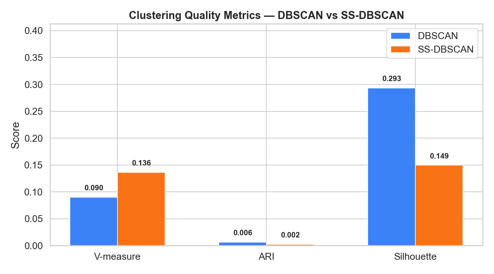
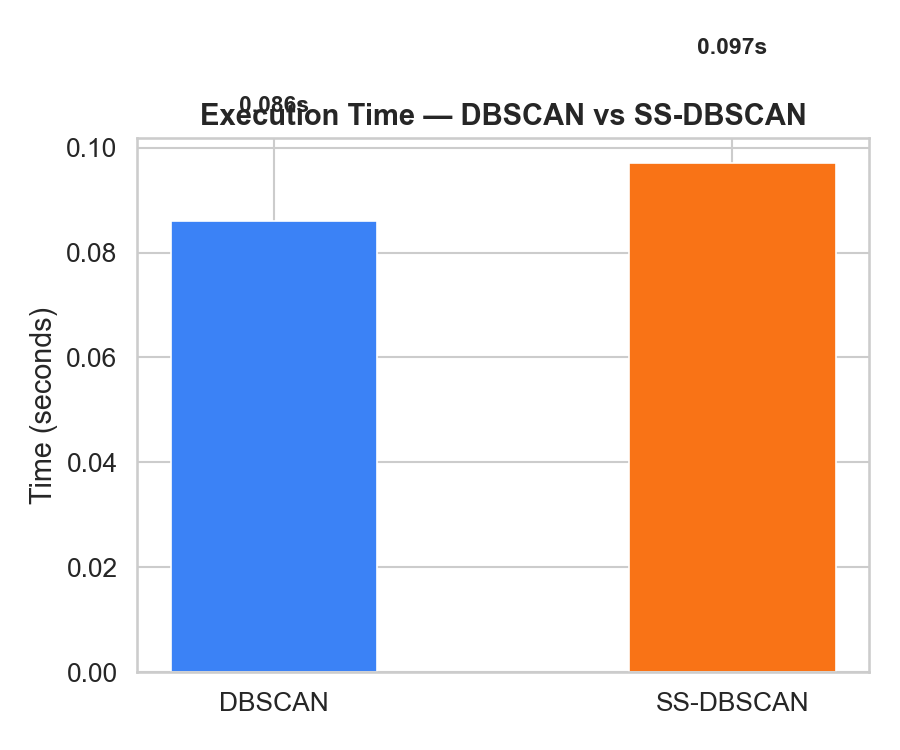
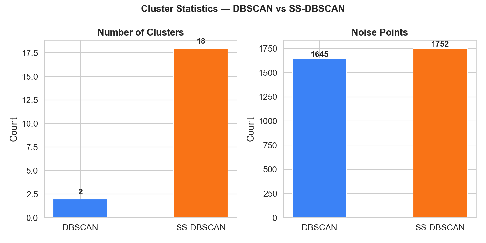

# 📄 SS-DBSCAN Lab Project Report

> **Subject:** Data Warehouse and Mining  
> **Project:** SS-DBSCAN — Semi-Supervised DBSCAN  
> **Dataset:** Letters Recognition (UCI, 20 000 instances, 16 features)  
> **Reference Paper:** Abdulhameed et al., *IEEE Access*, vol. 12, 2024

---

## 1. Simple Algorithm Description (DBSCAN)

DBSCAN (**D**ensity-**B**ased **S**patial **C**lustering of **A**pplications with **N**oise) is an unsupervised clustering algorithm that groups data points based on how densely they are packed together.

### How it works — in plain English

1. **Pick any unvisited point** from the dataset.
2. **Find its neighbours** — all points within a distance *Eps* (Epsilon).
3. **If the neighbourhood is dense enough** (≥ *MinPts* neighbours), the point becomes a **core point** and a new cluster starts growing from it.
4. **Expand the cluster** by visiting each neighbour: if a neighbour is also a core point, its neighbours are added to the cluster too. This continues recursively.
5. **If the neighbourhood is too sparse**, the point is labelled **noise** (outlier).
6. Repeat until every point has been visited.

### Key properties

- **No need to specify the number of clusters** beforehand (unlike K-Means).
- Can find **clusters of arbitrary shape** (circles, crescents, etc.).
- Automatically detects **noise / outlier** points.
- Only two parameters: *Eps* (neighbourhood radius) and *MinPts* (minimum density).

### Limitation

When a dataset has **clusters of varying densities**, a single *Eps* value may merge small dense clusters into one large cluster, or split a valid cluster into fragments.

---

## 2. Research Paper Algorithm Description (SS-DBSCAN)

SS-DBSCAN (**S**emi-**S**upervised DBSCAN) is a modification of DBSCAN proposed by Abdulhameed et al. (2024). It solves the varying-density problem by adding a **domain-knowledge condition** called `Is_important(point)`.

### Core Idea

In standard DBSCAN, a point becomes a core point solely if it has ≥ *MinPts* neighbours within *Eps*. SS-DBSCAN adds a **second condition**:

```
Is_core = (neighbour_count >= MinPts)  AND  Is_important(point)
```

The `Is_important` function encodes **human insight** about which points are meaningful enough to act as cluster centres. This restricts the set of core points, preventing small clusters from being absorbed into large ones.

### Algorithm (Pseudocode)

```
Algorithm: SS-DBSCAN
Input: Dataset D, Eps, MinPts, Is_important function

1.  Compute pairwise distance matrix
2.  Cluster = 0; label all points as "unvisited"
3.  For each unvisited point p:
      a. Find all neighbours of p within Eps
      b. If neighbour count < MinPts → label p as NOISE
      c. Else:
           Cluster += 1; assign p to Cluster
           Put neighbours in a FIFO queue
           While queue not empty:
              q = dequeue next point
              If q is noise → reassign q to Cluster
              If q is unvisited:
                 Assign q to Cluster
                 Find q's neighbours
                 ┌──────────────────────────────────────┐
                 │ SS-DBSCAN MODIFICATION:               │
                 │ is_core = (q_neighbours >= MinPts)    │
                 │           AND Is_important(q)         │
                 └──────────────────────────────────────┘
                 If is_core → add q's neighbours to queue
4.  Return labels
```

### Is_important for Letters Recognition (Case Study 1)

For the Letters dataset (16 pixel-statistics features per letter):
- **Excluded features** (1-indexed): F1, F2, F3, F4, F10
- **Condition:** A letter is *important* if **any** of its remaining features has a value ≥ `max(feature_column) − 2`
- This identifies letters with **high clarity / contrast** — making them better cluster representatives.

---

## 3. Parameters (Difference Table)

| Parameter | DBSCAN (Simple) | SS-DBSCAN (Research Paper) |
|---|---|---|
| **Eps** (ε) | User-specified neighbourhood radius | Same — user-specified |
| **MinPts** | User-specified minimum neighbours | Same — user-specified |
| **Core point rule** | `neighbours ≥ MinPts` | `neighbours ≥ MinPts` **AND** `Is_important(point)` |
| **Is_important** | ❌ Not present | ✅ Domain-specific function |
| **Supervised info** | None (fully unsupervised) | Partial — uses prior knowledge about features |
| **Time complexity** | O(n²) worst case | O(n²) worst case (same) |
| **Number of clusters** | Fewer, larger clusters | More, finer-grained clusters |
| **Noise handling** | Automatic | Automatic (slightly more noise due to stricter core rule) |
| **Best suited for** | Uniform density data | **Varying density** data |

---

## 4. Graph Comparison

We ran both algorithms on a **2 000-sample subset** of the Letters Recognition dataset with:
- **Eps = 4** (from the paper's elbow analysis)
- **MinPts = 17** (D + 1 = 16 + 1 for noiseless data)

### 4.1 Clustering Quality Metrics



- **V-measure:** SS-DBSCAN (0.136) vs DBSCAN (0.090) — **~51% improvement**
- **ARI:** Both near zero — expected since 2000 random samples don't preserve full class structure
- **Silhouette:** DBSCAN has higher Silhouette (0.293) because it creates only 2 large, compact clusters; SS-DBSCAN's 18 smaller clusters have lower intra-cluster compactness but are more *meaningful*

### 4.2 Execution Time



Both algorithms run in nearly identical time (~0.09s). The `Is_important` check adds negligible overhead since it's an O(D) per-point operation dwarfed by the O(n²) distance computation.

### 4.3 Cluster Statistics



- **DBSCAN:** 2 clusters, 1645 noise points → merges most letters into 2 giant clusters
- **SS-DBSCAN:** 18 clusters, 1752 noise points → identifies finer structure by restricting core points

---

## 5. Code Implementation

### 5.1 Simple Algorithm — DBSCAN (`dbscan.py`)

```python
"""
DBSCAN — From-scratch implementation
=====================================
Core idea: A point is a core point if it has at least MinPts
neighbours within Eps distance. Clusters grow by connecting
core points and their reachable neighbours.
"""

import numpy as np
from scipy.spatial.distance import cdist
import time


class DBSCAN:
    def __init__(self, eps: float, min_pts: int):
        self.eps = eps
        self.min_pts = min_pts
        self.labels_ = None
        self.n_clusters_ = 0
        self.n_noise_ = 0
        self.execution_time_ = 0.0

    def fit(self, X: np.ndarray) -> "DBSCAN":
        start = time.perf_counter()
        n = X.shape[0]

        # Step 1: Pre-compute pairwise distance matrix
        dist_matrix = cdist(X, X, metric="euclidean")

        labels = np.zeros(n, dtype=int)  # 0 = unvisited
        cluster_id = 0

        for i in range(n):
            if labels[i] != 0:
                continue  # already processed

            # Step 2: Find all neighbours within Eps
            neighbours = np.where(dist_matrix[i] <= self.eps)[0].tolist()

            # Step 3: Core point check
            if len(neighbours) < self.min_pts:
                labels[i] = -1  # noise
                continue

            # Step 4: Start a new cluster and expand
            cluster_id += 1
            labels[i] = cluster_id

            queue = list(neighbours)   # FIFO queue
            ptr = 0

            while ptr < len(queue):
                q = queue[ptr]
                ptr += 1

                if labels[q] == -1:
                    labels[q] = cluster_id   # border point
                    continue
                if labels[q] != 0:
                    continue

                labels[q] = cluster_id
                q_neighbours = np.where(
                    dist_matrix[q] <= self.eps
                )[0].tolist()

                # If q is also a core point, expand further
                if len(q_neighbours) >= self.min_pts:
                    queue.extend(q_neighbours)

        self.labels_ = labels
        self.n_clusters_ = cluster_id
        self.n_noise_ = int(np.sum(labels == -1))
        self.execution_time_ = time.perf_counter() - start
        return self
```

### 5.2 Research Paper Algorithm — SS-DBSCAN (`ss_dbscan.py`)

```python
"""
SS-DBSCAN — Semi-Supervised DBSCAN
====================================
Key modification: adds Is_important(point) condition to core
point identification (Algorithm 1, line 17 in the paper).
"""

import numpy as np
from scipy.spatial.distance import cdist
import time
from typing import Callable, Optional


class SS_DBSCAN:
    def __init__(self, eps, min_pts, is_important_fn=None):
        self.eps = eps
        self.min_pts = min_pts
        self.is_important_fn = is_important_fn  # <-- Extra condition
        self.labels_ = None
        self.n_clusters_ = 0
        self.n_noise_ = 0
        self.execution_time_ = 0.0

    def fit(self, X):
        start = time.perf_counter()
        n = X.shape[0]
        dist_matrix = cdist(X, X, metric="euclidean")
        labels = np.zeros(n, dtype=int)
        cluster_id = 0

        for i in range(n):
            if labels[i] != 0:
                continue
            neighbours = np.where(dist_matrix[i] <= self.eps)[0].tolist()
            if len(neighbours) < self.min_pts:
                labels[i] = -1
                continue

            cluster_id += 1
            labels[i] = cluster_id
            queue = list(neighbours)
            ptr = 0

            while ptr < len(queue):
                q = queue[ptr]
                ptr += 1
                if labels[q] == -1:
                    labels[q] = cluster_id
                    continue
                if labels[q] != 0:
                    continue

                labels[q] = cluster_id
                q_neighbours = np.where(
                    dist_matrix[q] <= self.eps
                )[0].tolist()

                # ─────────────────────────────────────────
                # SS-DBSCAN MODIFICATION (line 17):
                #   is_core = len(neighbours) >= MinPts
                #             AND Is_important(point)
                # ─────────────────────────────────────────
                is_core = len(q_neighbours) >= self.min_pts
                if is_core and self.is_important_fn is not None:
                    is_core = self.is_important_fn(q, X)

                if is_core:
                    queue.extend(q_neighbours)

        self.labels_ = labels
        self.n_clusters_ = cluster_id
        self.n_noise_ = int(np.sum(labels == -1))
        self.execution_time_ = time.perf_counter() - start
        return self


# ── Is_important for Letters Recognition Dataset ──────────
def make_letters_is_important(X):
    """
    Predicate (13) from the paper:
    A letter is important if ANY of its selected features
    has a value >= max(column) - 2.
    Excluded features (0-indexed): 0, 1, 2, 3, 9
    """
    excluded = {0, 1, 2, 3, 9}
    selected = [j for j in range(X.shape[1]) if j not in excluded]
    col_max = {j: X[:, j].max() for j in selected}

    def is_important(idx, data):
        for j in selected:
            if data[idx, j] >= col_max[j] - 2:
                return True
        return False

    return is_important
```

---

## 6. Theoretical Differences

| Aspect | DBSCAN | SS-DBSCAN |
|---|---|---|
| **Type** | Fully unsupervised | Semi-supervised |
| **Core point definition** | Based only on density (MinPts + Eps) | Density **+** domain-specific importance condition |
| **Human knowledge** | Not used | Required to define `Is_important` |
| **Cluster granularity** | Tends to create fewer, larger clusters | Creates more, finer-grained clusters |
| **Varying density datasets** | Struggles — merges different density regions | Handles well — restricts core points to important ones |
| **Noise sensitivity** | Less noise (more points absorbed) | More noise (stricter core definition) |
| **Adaptability** | One-size-fits-all | Customizable per dataset/objective |
| **Time complexity** | O(n²) | O(n²) — same; `Is_important` adds only O(D) per point |

### Key conceptual insight

DBSCAN treats **all dense points equally**. In datasets with varying densities, a point in a dense region easily becomes a core point, causing its cluster to absorb neighbouring sparse clusters.

SS-DBSCAN solves this by asking: *"Is this point meaningful enough to act as a cluster centre?"* Only when the answer is YES (via `Is_important`) can a point become core. This **reduces the number of core points**, breaking up incorrectly merged clusters into smaller, more meaningful ones.

---

## 7. Time Analysis (Computation)

### 7.1 Theoretical Complexity

| Step | DBSCAN | SS-DBSCAN |
|---|---|---|
| Distance matrix computation | O(n² × D) | O(n² × D) |
| Neighbourhood queries (per point) | O(n) | O(n) |
| Core point check | O(1) | O(1) + O(D) for `Is_important` |
| Overall worst case | **O(n²)** | **O(n²)** |

> Adding the `Is_important` condition does **NOT** change the overall time complexity, as it runs in O(D) per point, which is dominated by the O(n) neighbourhood scanning.

### 7.2 Measured Execution Times

| Algorithm | Time (seconds) | Samples | Eps | MinPts |
|---|---|---|---|---|
| DBSCAN | **0.086 s** | 2 000 | 4 | 17 |
| SS-DBSCAN | **0.097 s** | 2 000 | 4 | 17 |

The difference is negligible (~12 ms). The `Is_important` function adds minimal overhead since it performs a simple feature-value comparison for each of the 11 selected columns (out of 16).

### 7.3 Time Comparison Graph


### 7.4 Scalability Note

Both algorithms use a pre-computed distance matrix, requiring O(n²) memory. For very large datasets (n > 50 000), spatial indexing (e.g., KD-Tree, Ball Tree) should be used to reduce complexity to O(n log n).